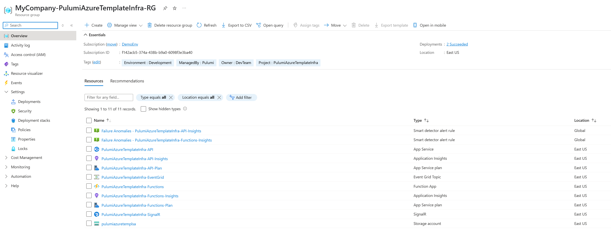

# Pulumi Azure Infrastructure Template

A production-ready Pulumi template for deploying containerized applications to Azure with all essential services.

## What This Deploys

- Resource Group - Organized resource container
- App Service - Containerized web application (Linux + Docker)
- Function App - Containerized serverless background processing
- SignalR Service - Real-time communication
- Event Grid Topic - Event-driven messaging
- Application Insights - Monitoring and telemetry
- Storage Accounts - Function runtime and blob storage



*Example of deployed Azure resources after running `pulumi up`*

## Quick Start

### 1. Prerequisites
```bash
# Install Pulumi CLI, .NET 6.0 SDK, Azure CLI
az login
```

### 2. Clone and Customize
```bash
git clone <your-template-repo>
cd PulumiAzureTemplateInfra

# Update Pulumi.dev.yaml with your settings:
# - Resource names, Docker images, environment details
```

### 3. Set Secrets
```bash
./add-secrets.ps1
# Update script with your actual secret values first
```

### 4. Deploy
```bash
dotnet restore
pulumi up
```

## Why This Template?

### Built for Containerized Microservices
- Assumes your applications run in Docker containers
- Consistent deployment patterns across all services
- Secure Docker registry integration

### Standardized Configuration
Every microservice uses the same YAML structure:
```yaml
ServiceName:ApiAppSettings:
  ExternalApi:
    BaseUrl: https://api.example.com
    Timeout: 30
  Features:
    EnableCaching: true
```

### No Code Changes for Config Updates
The ConfigParser handles nested YAML dynamically - add new config sections without touching C# code.

### Team Consistency
- Same patterns across all microservices
- New developers understand any service instantly
- Faster code reviews and debugging

### Modular Architecture
- **Partial Classes**: Infrastructure code is split by Azure service for better organization
- **Separation of Concerns**: Each Azure service has its own dedicated file
- **Maintainability**: Easy to find and modify service-specific infrastructure
- **Team Collaboration**: Multiple developers can work on different services simultaneously
- **Clean Code**: Focused, smaller files instead of one monolithic infrastructure file

## Customization

### For Your Project:

1. **Update Names**
   - Change `PulumiAzureTemplateInfra` to `YourApp` in all files
   - Update resource names in `Pulumi.dev.yaml`

2. **Configure Docker Images**
   ```yaml
   DockerSettings:
     DockerRegistryUrl: yourregistry.azurecr.io
     DockerApiImageName: your-api-image
     DockerFnImageName: your-functions-image
   ```

3. **Add Your App Settings**
   ```yaml
   ApiAppSettings:
     YourFeature:
       Setting1: value1
       Setting2: value2
   ```

4. **Update Secrets**
   - Modify `add-secrets.ps1` with your actual values
   - Add/remove secrets in `helpers/SecretAccess.cs` as needed

## Working with the Infrastructure Code

### Partial Class Architecture
The infrastructure is organized using C# partial classes for better maintainability:

- **`stack/ContainerizedStack.cs`**: Main orchestration and resource group creation
- **`stack/ContainerizedStack.ApiAppService.cs`**: All API App Service related infrastructure
- **`stack/ContainerizedStack.FunctionApp.cs`**: Azure Functions and storage infrastructure  
- **`stack/ContainerizedStack.SignalR.cs`**: SignalR Service infrastructure
- **`stack/ContainerizedStack.EventGrid.cs`**: Event Grid Topic infrastructure

### Helper Classes
Supporting utilities are organized in the `helpers/` folder:

- **`helpers/DeploymentConfigs.cs`**: Parses and provides strongly-typed access to configuration
- **`helpers/ConfigParser.cs`**: Dynamic YAML configuration parser
- **`helpers/SecretAccess.cs`**: Secure secret management and connection string builders

### Adding New Azure Services
1. Create a new partial class file: `stack/ContainerizedStack.NewService.cs`
2. Add the required using statements for the Azure service
3. Implement your `CreateNewService` method
4. Call it from the main constructor in `stack/ContainerizedStack.cs`

### Modifying Existing Services
- Navigate to the specific partial class file in the `stack/` folder for the service you want to modify
- Each file contains all related methods and configuration for that service
- Changes are isolated and don't affect other services

## Project Structure

```
PulumiAzureTemplateInfra/
├── Pulumi.yaml                         # Main project config
├── Pulumi.dev.yaml                     # Environment settings
├── Program.cs                          # Entry point
├── add-secrets.ps1                     # Secret setup script
├── docs/
│   └── deployed-resources.png          # Architecture diagram
├── helpers/
│   ├── ConfigParser.cs                 # Dynamic YAML parser
│   ├── DeploymentConfigs.cs            # Configuration parser
│   └── SecretAccess.cs                 # Secure secret management
├── stack/
│   ├── ContainerizedStack.cs           # Main stack orchestration
│   ├── ContainerizedStack.ApiAppService.cs # API App Service infrastructure
│   ├── ContainerizedStack.FunctionApp.cs   # Azure Functions infrastructure
│   ├── ContainerizedStack.SignalR.cs       # SignalR Service infrastructure
│   └── ContainerizedStack.EventGrid.cs     # Event Grid Topic infrastructure
└── README.md                           # This file
```

## Security Features

- Encrypted secrets management via Pulumi
- Secure connection strings built dynamically  
- Consistent tagging for cost management
- Environment separation (dev/staging/prod)

## Next Steps

1. **Customize** the template for your needs
2. **Create your containerized applications** and push to registry
3. **Set up CI/CD** pipelines using this infrastructure
4. **Scale to multiple microservices** by replicating this pattern

---

Perfect for teams building containerized microservices on Azure.